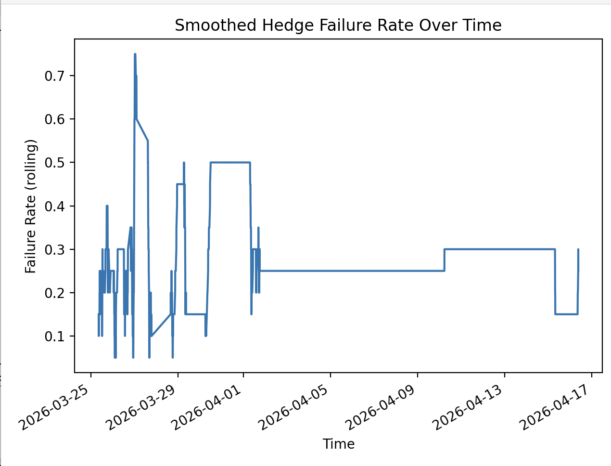

# Testing

Because Polymarket does not provide especially convenient access for this workflow, I initially funded the bot with a small amount of capital and recorded its live trades. I then used this Python script to measure how many hedges completed successfully and to visualise when failures were clustered over time.

## Performance Summary

| Metric | Count |
|---------------------|------:|
| Total markets | 384 |
| Successful hedges | 337 |
| Failed hedges | 47 |

<<<<<<< HEAD
These results show that the hedge completion rate was not high enough for the strategy to be reliably scalable. For the model to work consistently, successful hedges would need to account for over 98% of trades, whereas the observed rate here was closer to 78%. Despite that, the realised PnL over the period was still positive.
=======
These results show that the hedge completion rate was not high enough for the strategy to be reliably scalable. For the model to work consistently, successful hedges would likely need to account for well over 98% of trades, whereas the observed rate here was closer to 88%. Despite that, the realised PnL over the period was still positive at roughly $2.
>>>>>>> aa62bba (update readme)

To understand this outcome, I analysed the composition of “failed hedges” and found that a subset remained profitable. In these cases, only one leg of the hedge was filled, and that position happened to resolve to the correct side. This introduces an unintended directional exposure component, meaning the strategy is not purely market-neutral in practice.
More broadly, the results reflect the limitations of the Polymarket API and order book during volatile periods. 

## Timings of Failed Trades

The chart shows that failed hedges were not evenly distributed over time. Instead, they appeared in clusters, with the most notable spike occurring in the early hours of 24 March. Looking at Bitcoin's price action on that day, it rose by roughly 4.5%, which helps explain the behaviour: in strongly directional conditions, the `UP` token often never traded below $0.50, so both sides of the hedge could not be filled.

## Improvements

Reviewing these results suggests several ways the strategy could be improved. For the bot to work reliably, there needs to be sufficient order-book volume and relatively balanced short-term price action; otherwise, one leg is unlikely to fill.

One possible improvement would be to add a simple market regime filter based on recent Bitcoin price movement. For example, if Bitcoin has moved strongly in one direction over the previous two 5-minute intervals, the bot could avoid entering the next market, where the probability of completing both legs may be lower.
