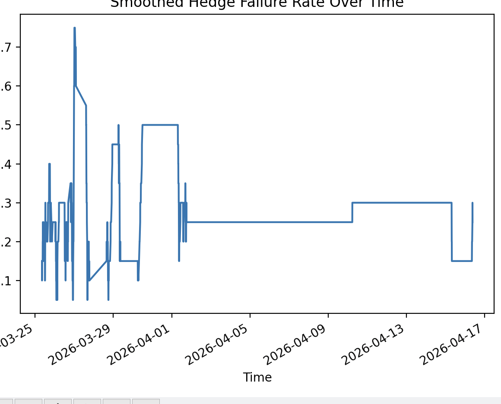

# Testing

As Polymarket doesn't have easy acces to API's I gave the bot a small amount of money to begin with and recorder its trades. I then used this python script to record how many were succesful as well as to show a graph of the times when they weren't completed.

## Performance Summary

| Metric              | Count |
|---------------------|------:|
| Total markets       | 491   |
| Successful hedges   | 370   |
| Failed hedges       | 121   |

From this we can see that the the success rate was not exceptentially high. For this strategy to work the Succesful hedges need to make up over 98%, whereas this is around 78%. However, the actual PnL of the bot was positive ~2 dollars over this time frame. Looking back at this I can see that some of the "Failed hedges" filled only the side that resolved to 1 dollar, resulting in $2.50 of profit. This shows the current reliability of the polymarket API as well as orderbook, especially in volatile conditions.

## Timings of failed trades

From this graph we can see that there are certain spikes when multiple hedges failed. The most notable is on the 26th March. Looking at bitcoin's trend here, it can be seen that it dropped 3.5% that day, this means that often on polymarket, the down token would never trade below 50 cent and thus are orders wouldn't be filled. 

## Improvements

Upon reviewing this, improvements can be made to ensure a higher return. For the bot to work it is imperative there is large volume in the order book and that bitcoin is not moving heavily in one direction, otherwise both legs are not filled. To better the model, data could be pulled if bitcoins price change and if it has been down for the past two five minute intervals then trading can be stopped for the last one as it is likely it will not be filled.